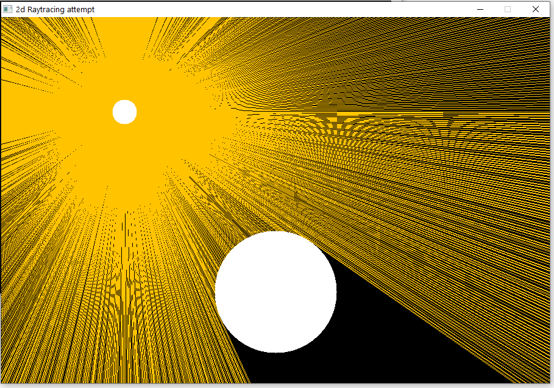

# C, SLD2 RayTracing 2D Attempt

## Main algorithm used: RayCasting algorith
I draw all the rays from the light source and compute their paths, it they encounter an obstacle or exit from the screen, their path stops.  
This way, obstacles shadows are draw.
Each ray is defined as a struct composed of a 2D Starting Point and an angle expressed in radiant.
Circle light sources emit ray in every direction.
Since rays are manually placed and drawn, they are finite in number so this is obviously an approximation.

